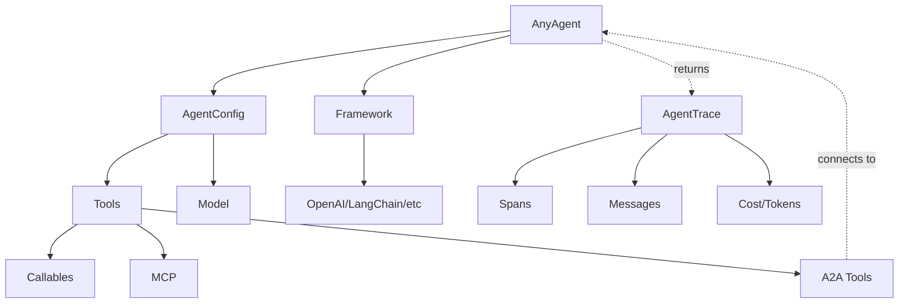

# AI Agent Guide for any-agent Framework

This guide is specifically designed to help AI agents understand and effectively use the any-agent framework. It provides structured information, clear patterns, and comprehensive examples.

> **Note on Model Names**: This guide uses model names like `gpt-4.1-mini` and `gpt-4o-mini` which appear throughout the any-agent documentation. These follow LiteLLM naming conventions. For the latest model names, refer to the [LiteLLM Provider Docs](https://docs.litellm.ai/docs/providers).

## Table of Contents

1. [Framework Overview](#framework-overview)
2. [Framework Capabilities Matrix](#framework-capabilities-matrix)
3. [Decision Trees](#decision-trees)
4. [Quick API Reference](#quick-api-reference)
5. [Component Dependencies](#component-dependencies)
6. [Input/Output Schemas](#inputoutput-schemas)
7. [Common Patterns](#common-patterns)
8. [Multi-Agent Systems](#multi-agent-systems)
9. [Multi-Turn Conversations](#multi-turn-conversations)
10. [Multi-Turn in Multi-Agent A2A](#multi-turn-in-multi-agent-a2a)
11. [Performance Optimization](#performance-optimization)
12. [Troubleshooting](#troubleshooting)
13. [Testing Patterns](#testing-patterns)

## Framework Overview

any-agent is a unified interface for multiple agent frameworks, providing a consistent API across:
- **tinyagent**: Lightweight, fast execution
- **openai**: OpenAI Agents SDK
- **langchain**: LangChain/LangGraph
- **llama_index**: LlamaIndex agents
- **smolagents**: HuggingFace Smolagents
- **google_adk**: Google Agents Development Kit
- **agno**: Agno AI framework

## Framework Capabilities Matrix

| Framework | Async Support | Tool Types | Multi-Agent | Streaming | Cost Efficiency | Best For |
|-----------|--------------|------------|-------------|-----------|-----------------|----------|
| tinyagent | ✅ | Callables, MCP | Via A2A | ❌ | High | Simple tasks, quick prototypes |
| openai | ✅ | Callables, MCP | Via A2A | ✅ | Medium | Production apps, complex reasoning |
| langchain | ✅ | Callables, MCP | Via A2A | ✅ | Medium | Complex chains, RAG systems |
| llama_index | ✅ | Callables, MCP | Via A2A | ✅ | Medium | Document QA, knowledge graphs |
| smolagents | ✅ | Callables, MCP | Via A2A | ❌ | High | Lightweight agents |
| google_adk | ✅ | Callables, MCP | Via A2A | ✅ | Medium | Google ecosystem integration |
| agno | ✅ | Callables, MCP | Via A2A | ✅ | Medium | General purpose |

## Decision Trees

### Framework Selection Decision Tree

```python
# DECISION TREE FOR FRAMEWORK SELECTION:
# 
# Need Google services integration? → Use 'google_adk'
# Need complex document processing? → Use 'llama_index'  
# Need production-ready with streaming? → Use 'openai'
# Need complex multi-step workflows? → Use 'langchain'
# Need lightweight/fast execution? → Use 'tinyagent' or 'smolagents'
# Not sure/general purpose? → Start with 'tinyagent'

from any_agent import AgentConfig, AnyAgent

# Example: Choosing framework based on use case
framework = "tinyagent"  # Default choice for simple tasks
```

### Model Selection by Task Complexity

```python
def select_model_by_complexity(task_description):
    """Select appropriate model based on task complexity."""
    complexity_keywords = {
        "simple": ["list", "summarize", "extract"],
        "medium": ["analyze", "compare", "explain"],
        "complex": ["create", "design", "solve", "debug"]
    }
    
    task_lower = task_description.lower()
    
    if any(keyword in task_lower for keyword in complexity_keywords["simple"]):
        return "gpt-3.5-turbo"
    elif any(keyword in task_lower for keyword in complexity_keywords["complex"]):
        return "gpt-4o"
    else:
        return "gpt-4o-mini"
```

## Quick API Reference

### Essential Imports

```python
from any_agent import AgentConfig, AnyAgent, AgentRunError
from any_agent.tools import search_web, visit_webpage, send_console_message
from any_agent.tools import a2a_tool, a2a_tool_async
from any_agent.config import MCPStdio, MCPSse
from any_agent.serving import A2AServingConfig
from any_agent.tracing import disable_console_traces
```

### Core Methods

```python
# Sync API
agent = AnyAgent.create(framework, config)
trace = agent.run(prompt, **kwargs)
agent.serve(serving_config)

# Async API  
agent = await AnyAgent.create_async(framework, config)
trace = await agent.run_async(prompt, **kwargs)
await agent.serve_async(serving_config)
```

### AgentConfig Parameters

- `model_id`: str (required) - LLM model identifier
- `instructions`: str - System prompt for the agent
- `tools`: List[Callable | MCPStdio | MCPSse] - Available tools
- `agent_args`: dict - Framework-specific arguments
- `model_args`: dict - Model parameters like `temperature`, `top_p`, etc.
- `output_type`: BaseModel - Pydantic model for structured output
- `name`: str - Agent name (default: "any_agent")
- `description`: str - Agent description for A2A agent cards

## Component Dependencies



## Input/Output Schemas

```python
from typing import TypedDict, List, Optional, Union

class AgentRunInput(TypedDict):
    prompt: str  # Required: The user's question or task
    max_turns: Optional[int]  # Default: 10
    stream: Optional[bool]  # Default: False
    context: Optional[List[dict]]  # Previous messages

class ToolInput(TypedDict):
    function_name: str
    arguments: dict
    
class AgentTraceOutput(TypedDict):
    final_output: str  # The agent's final answer
    spans: List[dict]  # Detailed execution trace
    cost: dict  # {"total_cost": float, "prompt_tokens": int, "completion_tokens": int}
    duration: dict  # {"total_seconds": float}
    error: Optional[str]  # Error message if failed
```

## Common Patterns

### Pattern: Complete Working Example

```python
"""
Complete Example: Web Search Agent
Requirements: pip install 'any-agent[openai]'
Environment: OPENAI_API_KEY must be set
Purpose: Search web for information and summarize findings
"""

import os
from any_agent import AgentConfig, AnyAgent, AgentRunError
from any_agent.tools import search_web, visit_webpage

# Validate environment
if not os.getenv("OPENAI_API_KEY"):
    raise ValueError("Please set OPENAI_API_KEY environment variable")

# Create agent with explicit configuration
agent = AnyAgent.create(
    framework="openai",  # Using OpenAI for better reasoning
    config=AgentConfig(
        model_id="gpt-4o-mini",  # Cost-effective model
        instructions=(
            "You are a web research assistant. "
            "Search for information and provide concise summaries. "
            "Always cite your sources."
        ),
        tools=[search_web, visit_webpage],
        model_args={"temperature": 0.7}  # Balanced creativity/accuracy
    )
)

# Run with error handling
try:
    result = agent.run(
        "What are the latest developments in quantum computing?",
        max_turns=5  # Limit iterations for cost control
    )
    print(f"Answer: {result.final_output}")
    print(f"Cost: ${result.cost.total_cost:.4f}")
    print(f"Duration: {result.duration.total_seconds():.2f}s")
except AgentRunError as e:
    print(f"Error: {e}")
    # Access partial trace even on error
    if e.trace:
        print(f"Partial result: {e.trace.final_output}")
```

### Pattern: Tool Creation

```python
from typing import Annotated

def my_custom_tool(
    query: Annotated[str, "The search query to execute"],
    max_results: Annotated[int, "Maximum number of results"] = 5
) -> str:
    """Search internal database for information.
    
    This tool searches the company's internal knowledge base.
    Returns formatted results or error message.
    """
    # Tool implementation
    return f"Found {max_results} results for: {query}"
```

### Pattern: Error Recovery

```python
def run_with_retry(agent, prompt, max_retries=3):
    for attempt in range(max_retries):
        try:
            return agent.run(prompt)
        except AgentRunError as e:
            if attempt == max_retries - 1:
                raise
            # Log and retry with modified prompt
            prompt = f"Previous attempt failed. Please try again: {prompt}"
```

## Multi-Agent Systems

### Architecture Patterns

#### Hub-and-Spoke Pattern

```python
"""
Hub-and-Spoke: One coordinator agent manages multiple specialist agents

    [Coordinator Agent]
         /    |    \
        /     |     \
   [Search] [Analyst] [Writer]
"""

# coordinator.py
from any_agent import AgentConfig, AnyAgent
from any_agent.tools import a2a_tool

# Connect to specialist agents (sync version - no multi-turn support)
search_agent = a2a_tool("http://localhost:5001/search")
analyst_agent = a2a_tool("http://localhost:5002/analyst")  
writer_agent = a2a_tool("http://localhost:5003/writer")

coordinator = AnyAgent.create(
    "openai",
    AgentConfig(
        model_id="gpt-4o",
        instructions="""You are a research coordinator. For research tasks:
        1. Use search_agent to find information
        2. Use analyst_agent to analyze the data
        3. Use writer_agent to create the final report
        Coordinate between agents to produce comprehensive results.""",
        tools=[search_agent, analyst_agent, writer_agent]
    )
)
```

#### Pipeline Pattern

```python
"""
Pipeline: Agents process data sequentially

[Input] -> [Preprocessor] -> [Analyzer] -> [Postprocessor] -> [Output]
"""

# Each agent serves a specific role in the pipeline
# preprocessor.py
preprocessor = AnyAgent.create(
    "tinyagent",
    AgentConfig(
        model_id="gpt-3.5-turbo",
        instructions="Clean and format input data for analysis",
        description="Data preprocessing agent"
    )
)
preprocessor.serve(A2AServingConfig(port=5001))
```

### Complete Multi-Agent Example: Research Team

```python
# research_team.py - Complete working example
import asyncio
from any_agent import AgentConfig, AnyAgent
from any_agent.serving import A2AServingConfig
from any_agent.tools import search_web, a2a_tool_async

# 1. Search Specialist Agent
async def create_search_agent():
    agent = await AnyAgent.create_async(
        "tinyagent",
        AgentConfig(
            name="search_specialist",
            model_id="gpt-3.5-turbo",
            instructions="Search for information on the web. Return raw search results.",
            description="Web search specialist - finds information quickly",
            tools=[search_web]
        )
    )
    return agent

# 2. Analysis Agent
async def create_analysis_agent():
    agent = await AnyAgent.create_async(
        "openai",
        AgentConfig(
            name="data_analyst",
            model_id="gpt-4o",
            instructions="Analyze data and identify patterns, insights, and key findings.",
            description="Data analyst - processes and analyzes information"
        )
    )
    return agent

# 3. Writing Agent  
async def create_writer_agent():
    agent = await AnyAgent.create_async(
        "langchain",
        AgentConfig(
            name="report_writer",
            model_id="gpt-4o-mini",
            instructions="Write clear, well-structured reports based on analysis.",
            description="Report writer - creates professional documents"
        )
    )
    return agent

# 4. Coordinator Agent
async def create_coordinator():
    # Get connections to other agents
    search_tool = await a2a_tool_async("http://localhost:5001/search")
    analyst_tool = await a2a_tool_async("http://localhost:5002/analyst")
    writer_tool = await a2a_tool_async("http://localhost:5003/writer")
    
    coordinator = await AnyAgent.create_async(
        "openai",
        AgentConfig(
            name="research_coordinator",
            model_id="gpt-4o",
            instructions="""You coordinate a research team. Your process:
            1. Use search_specialist to gather information
            2. Send findings to data_analyst for analysis  
            3. Send analysis to report_writer for final report
            4. Review and return the final report""",
            tools=[search_tool, analyst_tool, writer_tool]
        )
    )
    return coordinator

# Start all agents
async def main():
    # Create and serve specialist agents
    search = await create_search_agent()
    analyst = await create_analysis_agent()
    writer = await create_writer_agent()
    
    # Start serving in background
    asyncio.create_task(search.serve_async(A2AServingConfig(port=5001)))
    asyncio.create_task(analyst.serve_async(A2AServingConfig(port=5002)))
    asyncio.create_task(writer.serve_async(A2AServingConfig(port=5003)))
    
    # Wait for agents to start
    await asyncio.sleep(2)
    
    # Create and run coordinator
    coordinator = await create_coordinator()
    
    # Execute research task
    result = await coordinator.run_async(
        "Research the impact of AI on healthcare in 2024"
    )
    
    print(result.final_output)

if __name__ == "__main__":
    asyncio.run(main())
```

## Multi-Turn Conversations

### Basic Multi-Turn Example

```python
from any_agent import AgentConfig, AnyAgent

# Create your agent
agent = AnyAgent.create(
    "tinyagent",
    AgentConfig(
        model_id="gpt-4.1-mini",
        instructions="You are a helpful assistant. Use previous conversation context when available.",
    )
)

response1 = agent.run("What's the capital of California?")
print(f"Agent: {response1.final_output}")
conversation_history = response1.spans_to_messages()

# Convert previous conversation to readable format
history_text = "\n".join([
    f"{msg.role.capitalize()}: {msg.content}"
    for msg in conversation_history
    if msg.role != "system"
])

user_message = "What's the closest national park to that city"

full_prompt = f"""Previous conversation:
{history_text}

Current user message: {user_message}

Please respond taking into account the conversation history above."""

response2 = agent.run(full_prompt)
print(f"Agent: {response2.final_output}")  # Agent will understand "that city" refers to Sacramento
```

### Stateful Conversation Pattern

```python
# Stateful conversation with memory
from typing import List, Dict
import json

class StatefulAgent:
    def __init__(self, framework="openai", model_id="gpt-4o-mini"):
        self.agent = AnyAgent.create(
            framework,
            AgentConfig(
                model_id=model_id,
                instructions="""You are a helpful assistant with conversation memory.
                Always acknowledge previous context when relevant."""
            )
        )
        self.conversation_state = {
            "user_preferences": {},
            "topics_discussed": [],
            "action_history": []
        }
    
    def update_state(self, trace):
        """Extract and update conversation state."""
        # Parse agent output for state updates
        output = trace.final_output
        
        # Example: Extract mentioned topics
        if "discussing" in output.lower():
            topic = output.split("discussing")[1].split(".")[0].strip()
            if topic not in self.conversation_state["topics_discussed"]:
                self.conversation_state["topics_discussed"].append(topic)
    
    def run_with_state(self, user_input):
        """Run agent with state context."""
        state_context = f"Current state: {json.dumps(self.conversation_state, indent=2)}"
        
        full_prompt = f"""{state_context}

User: {user_input}

Respond naturally while considering the conversation state."""
        
        trace = self.agent.run(full_prompt)
        self.update_state(trace)
        
        return trace
```

### Context Window Management

```python
# Sophisticated context window management
import time

class ContextWindowManager:
    def __init__(self, agent, max_tokens=4000):
        self.agent = agent
        self.max_tokens = max_tokens
        self.full_history = []
        self.summary = ""
    
    def add_turn(self, user_input, agent_output):
        """Add a conversation turn."""
        self.full_history.append({
            "user": user_input,
            "agent": agent_output,
            "timestamp": time.time()
        })
    
    def get_relevant_context(self, current_query):
        """Get relevant context for current query."""
        # Strategy 1: Recency-based
        recent = self.full_history[-3:]
        
        # Strategy 2: Summary + recent
        context_parts = []
        if self.summary:
            context_parts.append(f"Summary: {self.summary}")
        
        for turn in recent:
            context_parts.append(f"User: {turn['user']}")
            context_parts.append(f"Assistant: {turn['agent']}")
        
        return "\n".join(context_parts)
    
    def run_with_context(self, user_input):
        """Run with managed context."""
        context = self.get_relevant_context(user_input)
        
        prompt = f"""Context:
{context}

Current query: {user_input}

Respond based on the context provided."""
        
        trace = self.agent.run(prompt)
        self.add_turn(user_input, trace.final_output)
        
        # Periodically summarize if history is long
        if len(self.full_history) % 10 == 0:
            self._update_summary()
        
        return trace
```

## Multi-Turn in Multi-Agent A2A

The A2A (Agent-to-Agent) protocol in any-agent supports sophisticated multi-turn conversations between agents, allowing them to maintain context across multiple interactions.

### Core Architecture

```python
"""
A2A Multi-Turn Architecture:

1. Task ID: Unique identifier for a conversation session
2. Context ID: Links related messages in a conversation
3. Task Manager: Stores conversation history server-side
4. History Formatter: Formats previous messages for context

Flow:
Client → A2A Server → Task Manager → Agent → Response
         ↑                ↓
         └── Stores History
"""
```

### How It Works

When an agent is served via A2A, it automatically gains multi-turn capabilities:

1. **First Message**: Creates a new task with unique task_id
2. **Subsequent Messages**: Include the same task_id to continue conversation
3. **Server Side**: TaskManager maintains conversation history
4. **Agent Side**: Receives formatted history with each request

### Complete Example: Customer Support Multi-Agent System

```python
# 1. Support Agent with Memory
from any_agent import AgentConfig, AnyAgent
from any_agent.serving import A2AServingConfig
from pydantic import BaseModel

class CustomerInfo(BaseModel):
    name: str | None = None
    issue: str | None = None
    account_id: str | None = None
    resolved: bool = False

support_agent = await AnyAgent.create_async(
    "openai",
    AgentConfig(
        name="support_agent",
        model_id="gpt-4o-mini",
        instructions="""You are a customer support agent. 
        Gather customer information across multiple interactions.
        Remember all details from previous messages.""",
        description="Customer support agent with conversation memory",
        output_type=CustomerInfo
    )
)

# Serve with task management
from any_agent.serving.config import default_history_formatter

await support_agent.serve_async(
    A2AServingConfig(
        port=5001,
        task_timeout_minutes=30,  # 30 minute conversation timeout
        history_formatter=default_history_formatter
    )
)

# 2. Coordinator Agent Using Support Agent
from any_agent.tools import a2a_tool_async

class SupportSession(BaseModel):
    customer_satisfied: bool
    issue_resolved: bool
    follow_up_needed: bool

# Create tool from support agent
support_tool = await a2a_tool_async("http://localhost:5001/support_agent")

coordinator = await AnyAgent.create_async(
    "openai",
    AgentConfig(
        model_id="gpt-4o",
        instructions="""Coordinate customer support sessions.
        Use the support agent for multi-turn conversations.
        The support agent will remember context - use the task_id!""",
        tools=[support_tool],
        output_type=SupportSession
    )
)

# Run multi-turn support session
result = await coordinator.run_async("""
Handle this support case with multiple interactions:
1. First ask for their name and issue
2. Then ask for their account ID
3. Finally confirm resolution
""")
```

### Direct A2A Client Multi-Turn

```python
# Direct client usage for fine-grained control
import httpx
from uuid import uuid4
from a2a.client import A2AClient
from a2a.types import MessageSendParams, SendMessageRequest

async def multi_turn_conversation():
    async with httpx.AsyncClient() as client:
        a2a_client = await A2AClient.get_client_from_agent_card_url(
            client, "http://localhost:5001"
        )
        
        # Start new conversation
        task_id = None
        context_id = str(uuid4())
        
        # Turn 1: Introduction
        request = SendMessageRequest(
            id=str(uuid4()),
            params=MessageSendParams(
                message={
                    "role": "user",
                    "parts": [{"kind": "text", "text": "Hi, I'm Alice"}],
                    "messageId": str(uuid4()),
                    "contextId": context_id
                }
            )
        )
        response1 = await a2a_client.send_message(request)
        task_id = response1.root.result.id  # Save task ID!
        
        # Turn 2: Continue conversation
        request2 = SendMessageRequest(
            id=str(uuid4()),
            params=MessageSendParams(
                message={
                    "role": "user", 
                    "parts": [{"kind": "text", "text": "What's my name?"}],
                    "messageId": str(uuid4()),
                    "contextId": context_id,
                    "taskId": task_id  # Include task ID to continue
                }
            )
        )
        response2 = await a2a_client.send_message(request2)
        # Agent will remember "Alice" from turn 1
```

### Advanced Pattern: Multi-Agent Conversation Handoff

```python
# Agents can hand off conversations to each other
class HandoffRequest(BaseModel):
    target_agent: str
    task_id: str
    context_summary: str

specialist_config = AgentConfig(
    model_id="gpt-4o-mini",
    instructions="""You are a specialist. 
    If you receive a handoff, acknowledge the context.
    If you need different expertise, create a HandoffRequest.""",
    tools=[create_handoff_tool()],
    output_type=HandoffRequest | str
)

async def handle_with_handoff(initial_query: str):
    """Handle query with potential handoffs between specialists."""
    current_agent = "general"
    task_id = str(uuid4())
    
    while True:
        agent_tool = await a2a_tool_async(f"http://localhost:500{current_agent}")
        result = await agent_tool(initial_query, task_id=task_id)
        
        if isinstance(result, HandoffRequest):
            # Switch to target agent with same task_id
            current_agent = result.target_agent
            initial_query = result.context_summary
        else:
            return result
```

### Configuration Options

```python
# A2A Serving Configuration for Multi-Turn
A2AServingConfig(
    # Task Management
    task_timeout_minutes=30,  # How long tasks are kept in memory
    task_cleanup_interval_minutes=5,  # How often to clean expired tasks
    
    # History Formatting
    history_formatter=custom_formatter,  # Custom history formatting function
    
    # Server Settings
    port=5000,
    host="localhost",
    endpoint="/",
    
    # Performance
    log_level="info"
)
```

### Best Practices for A2A Multi-Turn

1. **Task ID Management**
```python
import json

# Always extract and reuse task IDs
response = await agent_tool("Hello")
response_data = json.loads(response)
task_id = response_data.get("id")  # Extract task ID

# Continue conversation
follow_up = await agent_tool("Follow up question", task_id=task_id)

# Note: The sync version of a2a_tool doesn't support task_id parameter
# Use a2a_tool_async for multi-turn conversations
```

2. **Error Recovery**
```python
async def resilient_multi_turn(agent_tool, messages, task_id=None):
    """Handle errors in multi-turn conversations."""
    for i, message in enumerate(messages):
        try:
            result = await agent_tool(message, task_id=task_id)
            if i == 0 and not task_id:
                # Extract task_id from first response
                task_id = json.loads(result).get("id", task_id)
        except Exception as e:
            # On error, we can retry with same task_id
            logger.error(f"Turn {i} failed: {e}")
            # Implement retry logic
            
    return task_id
```

3. **Custom History Formatter**
```python
from any_agent.tracing.agent_trace import AgentMessage

def research_history_formatter(messages: list[AgentMessage], current_query: str) -> str:
    """Format history with emphasis on research progress."""
    if not messages:
        return current_query
    
    # Extract research progress from previous messages
    research_summary = []
    for msg in messages:
        if msg.role == "assistant" and "sources_found" in msg.content:
            research_summary.append(f"Previous findings: {msg.content}")
    
    history = "\n".join(research_summary[-3:])  # Last 3 findings
    
    return f"""Research context:
{history}

Current request: {current_query}

Continue building on previous research."""
```

## Performance Optimization

### Model Selection by Cost

```python
# Model selection for cost optimization
MODELS_BY_COST = {
    "budget": ["gpt-3.5-turbo", "claude-3-haiku"],
    "balanced": ["gpt-4o-mini", "claude-3-sonnet"],
    "premium": ["gpt-4o", "claude-3-opus", "gpt-4-turbo"]
}

def select_model_for_budget(task_complexity: str, budget_tier: str) -> str:
    """Select model based on task complexity and budget."""
    models = MODELS_BY_COST.get(budget_tier, MODELS_BY_COST["balanced"])
    
    if task_complexity == "simple":
        return models[0]  # Cheapest in tier
    elif task_complexity == "complex":
        return models[-1]  # Most capable in tier
    else:
        return models[len(models) // 2]  # Middle option
```

### Token-Efficient Context

```python
def create_efficient_context(history, max_tokens=1000):
    """Create token-efficient context."""
    essential_history = []
    tokens_used = 0
    
    # Always include most recent exchanges
    for msg in reversed(history[-6:]):  # Last 3 exchanges
        essential_history.insert(0, msg)
        tokens_used += estimate_tokens(msg)
    
    return essential_history
```

## Troubleshooting

### Common Issues and Solutions

#### Issue: "RuntimeError: This event loop is already running" in Jupyter

```python
# Solution: Add before any any-agent code
import nest_asyncio
nest_asyncio.apply()
```

#### Issue: Tool not executing

```python
# Check 1: Ensure tool has proper type annotations
def bad_tool(query):  # ❌ Missing annotations
    pass

def good_tool(query: str) -> str:  # ✅ Proper annotations
    """Tool description."""
    return "result"

# Check 2: Verify tool is in the tools list
agent = AnyAgent.create("tinyagent", AgentConfig(
    model_id="gpt-4o-mini",
    tools=[good_tool]  # ✅ Tool included
))
```

#### Issue: High costs

```python
# Solution: Use cost-control strategies
agent = AnyAgent.create("openai", AgentConfig(
    model_id="gpt-4o-mini",  # Use smaller model
    agent_args={"max_tokens": 500}  # Limit output
))

result = agent.run(prompt, max_turns=3)  # Limit iterations
```

#### Issue: Task Not Found in A2A

```python
# Problem: Task expired or doesn't exist
# Solution: Handle gracefully and start new conversation
try:
    result = await agent_tool("Continue", task_id=old_task_id)
except Exception as e:
    if "task not found" in str(e).lower():
        # Start fresh conversation
        result = await agent_tool("Let's start over: Continue")
```

## Testing Patterns

### Unit Testing Pattern

```python
import pytest
from unittest.mock import Mock, patch
from any_agent import AgentConfig, AnyAgent

@pytest.fixture
def mock_agent():
    """Create a mock agent for testing."""
    with patch('any_agent.AnyAgent.create') as mock:
        agent = Mock()
        agent.run.return_value = Mock(
            final_output="Test response",
            cost=Mock(total_cost=0.01),
            duration=Mock(total_seconds=lambda: 1.5)
        )
        mock.return_value = agent
        yield agent

def test_agent_response(mock_agent):
    """Test agent response handling."""
    result = mock_agent.run("Test prompt")
    assert result.final_output == "Test response"
    assert result.cost.total_cost == 0.01
```

### Integration Testing Pattern

```python
@pytest.mark.integration
async def test_multi_agent_communication():
    """Test communication between agents."""
    # Create test agents
    agent1 = await AnyAgent.create_async(
        "tinyagent",
        AgentConfig(model_id="gpt-3.5-turbo", instructions="Echo the input")
    )
    
    agent2 = await AnyAgent.create_async(
        "tinyagent", 
        AgentConfig(
            model_id="gpt-3.5-turbo",
            instructions="Uppercase the input",
            tools=[lambda x: agent1.run(x).final_output]
        )
    )
    
    result = await agent2.run_async("hello")
    assert "HELLO" in result.final_output.upper()
```

## Framework-Specific Features

### OpenAI Agents: Output Guardrails

```python
from pydantic import BaseModel
from agents import Agent, output_guardrail, GuardrailFunctionOutput

class SafeOutput(BaseModel):
    content: str
    is_safe: bool

@output_guardrail
async def safety_check(ctx, agent, output):
    # Implement safety logic
    return GuardrailFunctionOutput(
        output_info={"safe": True},
        tripwire_triggered=False
    )

agent = AnyAgent.create("openai", AgentConfig(
    model_id="gpt-4o-mini",
    agent_args={"output_guardrails": [safety_check]}
))
```

### LangChain: Complex Chains

```python
agent = AnyAgent.create("langchain", AgentConfig(
    model_id="gpt-4o-mini",
    instructions="Process documents and answer questions",
    agent_args={
        "memory": True,  # Enable conversation memory
        "verbose": True  # Show chain reasoning
    }
))
```

## MCP Tool Integration

### Local MCP Server (Stdio)

```python
agent = AnyAgent.create("tinyagent", AgentConfig(
    model_id="gpt-4o-mini",
    tools=[
        MCPStdio(
            command="npx",
            args=["-y", "@modelcontextprotocol/server-filesystem"],
            tools=["read_file", "write_file"],
            env={"WORKSPACE": "/path/to/workspace"}
        )
    ]
))
```

### Remote MCP Server (SSE)

```python
agent = AnyAgent.create("tinyagent", AgentConfig(
    model_id="gpt-4o-mini", 
    tools=[
        MCPSse(
            url="http://localhost:8000/sse",
            headers={"Authorization": "Bearer token"}
        )
    ]
))
```

## Summary

This guide provides AI agents with:

1. **Clear decision trees** for choosing frameworks and patterns
2. **Complete examples** that are self-contained and runnable
3. **Comprehensive multi-agent patterns** with different architectures
4. **Multi-turn conversation handling** for both single and multi-agent scenarios
5. **Performance optimization** strategies and benchmarks
6. **Troubleshooting guidance** for common issues
7. **Testing patterns** for reliability
8. **Framework-specific features** to leverage unique capabilities

The key to effectively using any-agent is understanding:
- **Framework selection** based on your use case
- **Tool integration** patterns (Callables, MCP, A2A)
- **Multi-turn conversations** for complex interactions
- **Multi-agent orchestration** for collaborative tasks
- **Error handling** and recovery strategies
- **Performance optimization** for cost and speed

Always start simple with a single agent, then expand to multi-agent systems only when the complexity truly requires it.
